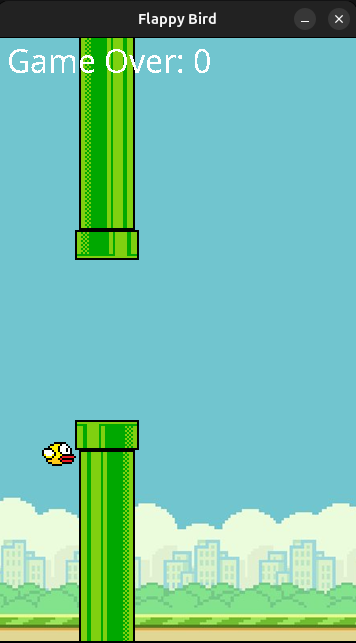

# Flappy Bird Clone in Java

A simple clone of the popular game *Flappy Bird* built using Java Swing and AWT libraries. This project is a fun, interactive way to learn basic Java graphics, game logic, and event handling.

## Table of Contents
1. [Features](#features)
2. [Game Preview](#game-preview)
3. [How to Play](#how-to-play)
4. [Setup and Installation](#setup-and-installation)
5. [Project Structure](#project-structure)
6. [Future Improvements](#future-improvements)

## Features
- **Basic Game Physics**: The bird falls due to gravity and can jump with the space bar.
- **Procedurally Generated Obstacles**: Pipes appear at intervals with randomized gaps for the bird to navigate through.
- **Score Tracking**: The game tracks the score based on how many pipes the bird successfully passes.
- **Game Over and Restart**: The game ends when the bird hits a pipe or the ground, and can be restarted.

## Game Preview



## How to Play
1. Press the **space bar** to make the bird jump.
2. Avoid colliding with pipes or the ground.
3. Every pair of pipes you pass increases your score.
4. If you crash, press the **space bar** again to restart the game.

## Setup and Installation

### Prerequisites
- **Java Development Kit (JDK)**: Make sure you have Java installed. You can download it from [Oracle's official website](https://www.oracle.com/java/technologies/javase-downloads.html) if needed.
- **Java IDE**: Any Java-compatible IDE, like IntelliJ IDEA or Eclipse, is recommended for running and editing the code.

### Steps
1. Clone the repository or download the source code:
   ```bash
   git clone https://github.com/your-username/flappy-bird-java-clone.git

